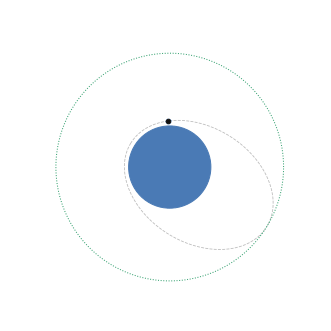
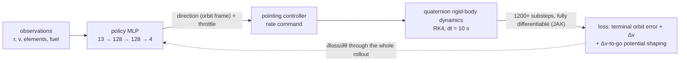
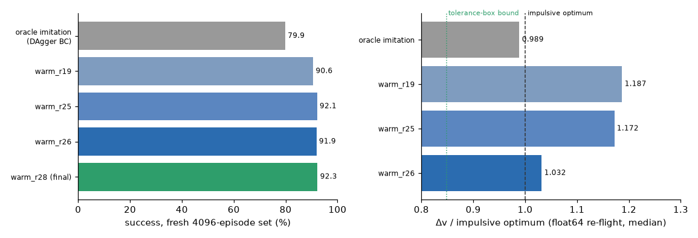
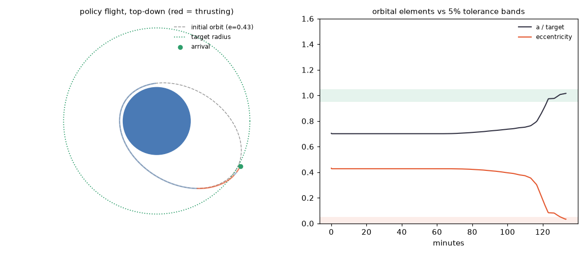
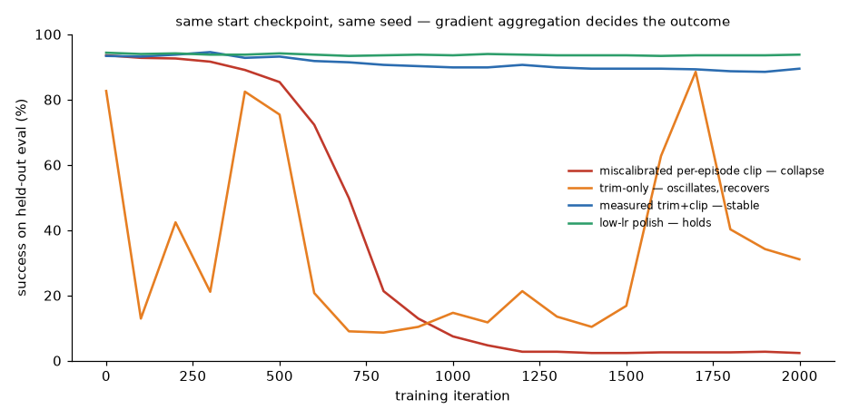

# TrajectoryBot — differentiable-simulation RL for orbital maneuvers

A from-scratch orbital-dynamics stack (no Basilisk, no poliastro) and a
policy-gradient agent that learns spacecraft maneuvers by **backpropagating
through the physics**, benchmarked against analytic transfers — with every
claim re-verified at high fidelity before it's stated.

<p align="center">
  
</p>

The agent is a small MLP at the **decision layer only**: every 200 s it emits
a thrust direction (in the orbit frame) and a throttle; a deterministic
pointing controller slews the spacecraft and a quaternion rigid-body
integrator does the physics. The policy never touches attitude directly —
burn *planning* is learned, burn *execution* is classical GNC.



## Verified results

<p align="center">
  
</p>

| Claim | Number | How it's verified |
|---|---|---|
| Success (5% tolerance terminal set, 3D) | **92.3%** | fresh 4096-episode set, never in-run telemetry |
| Fuel vs the impulsive analytic optimum | **1.03× median** (best-fuel policy, ~92% success) | float64 re-flight at dt = 1 s, clean episodes only, closed-form baseline (`scripts/verify_probe.py`) |
| Oracle it improves on | scripted analytic expert imitated at 79.9% | same fresh set |
| Sim gaming ruled out | 0 of 4096 episodes beat the admissible tolerance-box bound | same probe, both baselines |

Honest framing: the agent **matches** the analytic transfer's fuel cost while
running the full closed-loop attitude + finite-burn pipeline; it does not yet
beat it. The tolerance box admits solutions up to ~15% cheaper than exact
circularization — that quantified headroom is the open research target, and
the verification harness exists precisely so any future "beats the baseline"
claim survives scrutiny (integrator-energy audit, float64 re-flight,
clamp-region exclusion, per-geometry closed-form baselines).

Scope: the policies are trained for circularize-at-apoapsis with the target
radius equal to the initial apoapsis; generalizing across commanded target
radii is an open research lane, not a shipped capability.

<p align="center">
  
</p>

## Why differentiable simulation

Model-free RL was given every chance and walled out; exploiting the known,
exactly-differentiable dynamics wins by an order of magnitude (2-D milestone,
identical env):

| Method | Success | Δv vs optimal |
|---|---|---|
| Scripted analytic expert | 100% | 1.00 |
| Cold PPO (model-free, 8 runs) | 0–3% | — |
| Behavior cloning | ~16% | ~1.37 |
| DAgger | ~45% | ~1.5 |
| **Diff-sim policy gradient** | **81%** | 1.26 |

The 3-D stack ports the hot path to **JAX/XLA** (`scripts/jaxsim.py`):
`lax.scan` + `jit(value_and_grad)` over the full 1200-substep rollout,
numerically exact against the torch reference and **~50× faster** on a
consumer GPU — which is what made the research loop below possible.

## The part that was actually hard

Backprop-through-physics gradients are **heavy-tailed**: one episode in a
few hundred carries a gradient norm of 1e12–1e19 (finite, not NaN) and a
single Adam step can erase 12 points of success. Getting from "imitates the
oracle at 80%" to "92% and stable" was optimizer forensics, run as
pre-registered hypothesis-refutation rounds (30+, logged verbatim):

<p align="center">
  
</p>

Same start checkpoint, same seed — only the gradient aggregation differs.
The playbook that survived: **measure the per-episode norm distribution,
delete the monster tail (trimmed mean), clip survivors at the measured p90,
bank progress with an EMA policy, polish at low lr**. The failure modes en
route (truncation bias in short-horizon BPTT, absorbing-state mismatches,
potential-shaping traps that pay for zero progress, a normalize-epsilon that
seeded 1e6 gradients at every coast decision) are documented in
[`docs/EXPERIMENTS_3D.md`](docs/EXPERIMENTS_3D.md) (3-D campaign) and
[`docs/EXPERIMENTS.md`](docs/EXPERIMENTS.md) (2-D milestone).

## Quickstart

```bash
uv sync --extra dev            # Python 3.12+, from pyproject/uv.lock
uv run pytest                  # physics, baselines, envs, solvability
uv run pyright                 # strict typing on the shipped library

# 2-D milestone (torch)
uv run python scripts/train_circularize2d.py

# 3-D JAX training run (GPU; CPU works, slower)
uv run --with "jax[cuda12]" python scripts/jaxsim.py \
  --init models/dagger_jax.npz --iters 3000 --chunk 60 --lr 1e-4 \
  --absorb --phi-dv --d-eps 1e-4 --trim-ep 16 --clip-ep 20000 --ema 0.995

# verify a fuel claim at high fidelity (float64, dt=1 s, both baselines)
uv run --with jax python scripts/verify_probe.py models/<ckpt>.npz

# regenerate the README figures
uv run --with jax python scripts/viz_readme.py models/<ckpt>.npz <logdir>
```

Checkpoints and run logs are not committed (they regenerate by training);
`docs/media/` holds the small rendered figures only.

## Repository map

| Path | What it is |
|---|---|
| `tbot/` | The shipped library: quaternions, 2-D/3-D dynamics, orbital elements, attitude controller, Gymnasium envs. pyright-strict. |
| `scripts/jaxsim.py` | JAX/XLA 3-D diff-sim trainer (the research workhorse) with the full knob set. |
| `scripts/verify_probe.py` | float64/dt=1 s claim-verification harness (exact + tolerance-box baselines). |
| `scripts/eval_probe.py`, `norm_probe.py`, `step_probe.py`, … | The measurement toolkit the optimizer forensics ran on. |
| `docs/EXPERIMENTS_3D.md`, `docs/EXPERIMENTS.md` | The optimizer-forensics campaign (3-D) and the 2-D milestone methodology. |
| `docs/ROADMAP.md`, `docs/AUDIT.md` | Target maneuvers and the audit of the 2021 code. |
| `v2/`, `archive/` | The 2021 course project, kept as the honest "before" picture (excluded from CI/typing). |

## Roadmap

Circularize (3-D, done) → plane change → combined LEO→GEO transfer →
low-thrust (Edelbaum spiral) → multi-body with real JPL Horizons ephemerides
(Earth–Moon, Earth–Mars, capture) → benchmark against historically flown
trajectories. The N-body tier reuses the 2021 project's Horizons stack. For
any N-body fuel comparison, results must additionally be tested across
solar-system phases (syzygy effects are real physics but epoch-specific).

## Provenance

Started in 2021 as a graduate astrodynamics course project that trained but
never converged — the original report and code are preserved in
[`docs/final-report.md`](docs/final-report.md), `v2/`, and `archive/`, and
the revival began by auditing why it failed
([`docs/AUDIT.md`](docs/AUDIT.md)). Everything physics is hand-rolled on
purpose: the point is to own the whole stack from the RK4 up.

MIT licensed. See [CONTRIBUTING.md](CONTRIBUTING.md) for how changes are
evaluated (pre-registered experiments, verification-fidelity claims).
