# TrajectoryBot — differentiable-simulation RL for orbital maneuvers

A from-scratch orbital-dynamics stack (no Basilisk, no poliastro) and a
policy-gradient agent that learns spacecraft maneuvers by **backpropagating
through the physics**, benchmarked against analytic transfers — with every
claim re-verified at high fidelity before it's stated.

<p align="center">
  
</p>

The agent is a small MLP (multi-layer perceptron) at the **decision layer
only**: every 200 s it emits a thrust direction (in the orbit frame) and a
throttle; a deterministic pointing controller slews the spacecraft and a
quaternion rigid-body integrator does the physics. The policy never touches
attitude directly — burn *planning* is learned, burn *execution* is classical
GNC (guidance, navigation, and control).

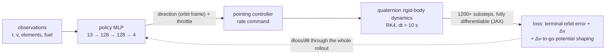

The whole policy is a tiny **13 → 128 → 128 → 4** tanh MLP — three weight
matrices, trained end-to-end through the physics:

<p align="center">
  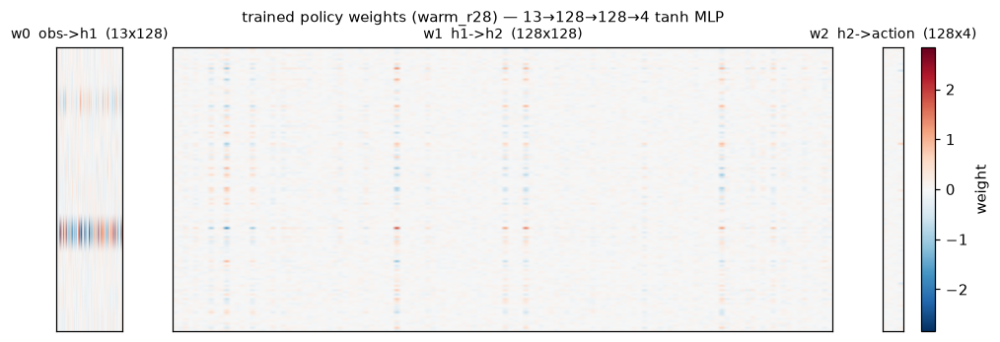
</p>

## Verified results

<p align="center">
  
</p>

| Claim | Number | How it's verified |
|---|---|---|
| Success (5% tolerance terminal set, 3D) | **92.3%** | fresh 4096-episode set, never in-run telemetry |
| Fuel vs the impulsive analytic optimum | **1.03× median** (best-fuel policy, ~92% success) | float64 re-flight at dt = 1 s, clean episodes only, closed-form baseline (`scripts/verify_probe.py`) |
| Oracle it improves on | scripted analytic expert imitated at 79.9% | same fresh set |
| Sim gaming ruled out | 0 of 4096 episodes beat the admissible tolerance-box bound | same probe, both baselines |

Honest framing: the agent **matches** the analytic transfer's fuel cost while
running the full closed-loop attitude + finite-burn pipeline; it does not yet
beat it. The tolerance box admits solutions up to ~15% cheaper than exact
circularization — that quantified headroom is the open research target, and
the verification harness exists precisely so any future "beats the baseline"
claim survives scrutiny (integrator-energy audit, float64 re-flight,
clamp-region exclusion, per-geometry closed-form baselines).

Scope: the headline policy above circularizes at its own apoapsis (target
radius = initial apoapsis). Generalizing across *commanded* target radii —
a degeneracy where that specialist collapses out-of-distribution (~18%
success once the target leaves its trained radius) — is solved separately.
A target-conditioned scripted expert (a two-apse tangential controller that
drives both apses to the commanded radius) DAgger'd into the same
13→128→128→4 network reaches **~99% success across commanded radii spanning
±15% of apoapsis** on fresh 4096-episode sets. The cause was not network
capacity or optimization but the *imitation source* — the specialist lineage
was cloned from a fixed-target expert and had never imitated tracking. See
[`scripts/dagger_target_jax.py`](scripts/dagger_target_jax.py).

<p align="center">
  
</p>

The final policy solves the distribution, not one lucky episode. Forty
random start orbits, each flown to termination, coloured by whether the
finish landed inside the 5% tolerance box:

<p align="center">
  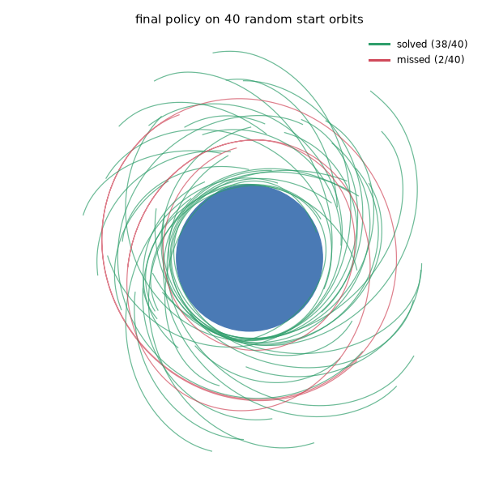
</p>

## Why differentiable simulation

Model-free RL was given every chance and walled out; exploiting the known,
exactly-differentiable dynamics wins by an order of magnitude (2-D milestone,
identical env):

| Method | Success | Δv vs optimal |
|---|---|---|
| Scripted analytic expert | 100% | 1.00 |
| Cold PPO (model-free, 8 runs) | 0–3% | — |
| Behavior cloning | ~16% | ~1.37 |
| DAgger | ~45% | ~1.5 |
| **Diff-sim policy gradient** | **81%** | 1.26 |

In 3-D, differentiable-sim refinement then climbs *past* the imitation oracle
it started from — each point is the fresh 4096-episode success of a
checkpoint along the campaign:

<p align="center">
  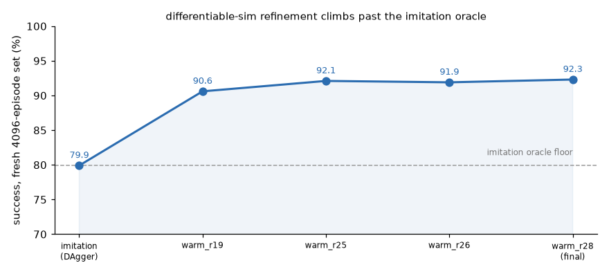
</p>

The 3-D stack ports the hot path to **JAX/XLA** (`scripts/jaxsim.py`):
`lax.scan` + `jit(value_and_grad)` over the full 1200-substep rollout,
numerically exact against the torch reference and **~50× faster** on a
consumer GPU — which is what made the research loop below possible.

## The part that was actually hard

Backprop-through-physics gradients are **heavy-tailed**: one episode in a
few hundred carries a gradient norm of 1e12–1e19 (finite, not NaN) and a
single Adam step can erase 12 points of success. Getting from "imitates the
oracle at 80%" to "92% and stable" was optimizer forensics, run as
pre-registered hypothesis-refutation rounds (30+, logged verbatim):

<p align="center">
  
</p>

Same start checkpoint, same seed — only the gradient aggregation differs.

And here is what that refinement buys on a single episode — the *same* start
orbit flown by four training stages, imitation → refined, cycling so you can
watch the path tighten onto the target ring:

<p align="center">
  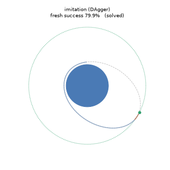
</p>

The playbook that survived: **measure the per-episode norm distribution,
delete the monster tail (trimmed mean), clip survivors at the measured p90,
bank progress with an EMA (exponential moving average) policy, polish at low
lr**. The failure modes en route (truncation bias in short-horizon
backpropagation through time, absorbing-state mismatches,
potential-shaping traps that pay for zero progress, a normalize-epsilon that
seeded 1e6 gradients at every coast decision) are documented in
[`docs/EXPERIMENTS_3D.md`](docs/EXPERIMENTS_3D.md) (3-D campaign) and
[`docs/EXPERIMENTS.md`](docs/EXPERIMENTS.md) (2-D milestone).

## Beyond circularize: the research frontier

The same backprop-through-physics approach extends to multi-body dynamics and to
maneuvers where a fidelity term the textbook ignores changes the optimal strategy.
Two recent threads (full methodology and verdicts in
[`docs/ROADMAP.md`](docs/ROADMAP.md)):

**Ballistic capture at the Moon (CR3BP).** A hand-rolled differentiable
circular-restricted three-body engine (rotating Earth–Moon frame, Jacobi constant
conserved to ~1e-7), the stable manifold of an L2 Lyapunov orbit computed from its
monodromy matrix (symplectic, det = 1), and a manifold-seeded transfer that arrives
*captured* at the Moon: Moon-relative energy < 0, staying bound for **4.6 lunar
revolutions** (~26 days, verified at dt = 5e-5) with **no capture burn**, where a
naive departure-burn search finds none.

<p align="center">
  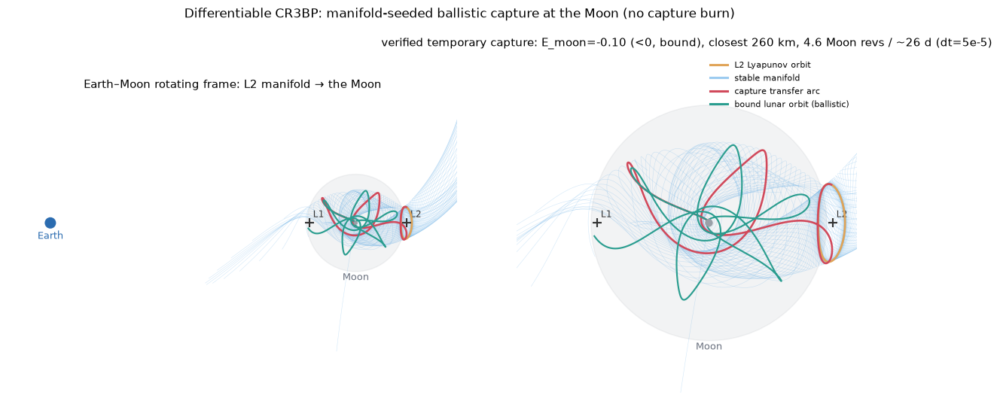
  <br/>
  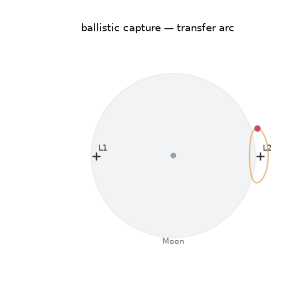
</p>

**Rediscovering J2 nodal-drift phasing.** For a RAAN (orbital-plane) change, the
textbook impulsive plane change is J2-*blind* — but J2 oblateness precesses the node
for free, faster at lower altitude. A diff-sim policy minimizing true Δv over J2-on
dynamics, with no maneuver structure baked in, **rediscovers the operational phasing
technique**: dive to a lower altitude, let the node drift faster, return. It reaches
the target node for ~0.88× the Δv of naive passive waiting at 30°, falling to a
quarter–half at 60–90° (the bigger the node change, the more the dive pays) — and
lands within ~10–15% of an *analytic* optimization of that same dive-drift strategy
(which is slightly cheaper still). So this is autonomous rediscovery of a known
technique from the raw objective, **not a novel beat**: the same genre as the agent
rediscovering the raise-to-plane-change trick elsewhere in the project.

<p align="center">
  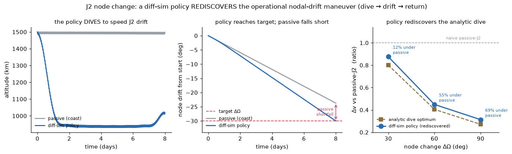
</p>

Both results come with their deflations attached: the capture is in the idealized
CR3BP (not real JPL ephemerides yet); the J2 result is a rediscovery that an
analytic dive beats, and its low-thrust Δv is idealized (impulsive-per-step). The
regimes where the savings vanish (small node angles, budgets so long that passive
is free) are recorded per build.

## Gravity assists in the real solar system

The circularize and J2 work runs in a two-body field. The next tier flies the
spacecraft through the *actual* solar system: a JAX rollout under many point-mass
bodies whose positions come from JPL Horizons, differentiable end to end, so
`∂(miss distance)/∂(maneuver)` drops out of the same backprop. The engine is
checked offline before any claim is made — the two-body Kepler limit closes to
`|Δr|/a = 9e-13`, energy holds to `7e-15`, and from a cold `Δv = 0` start the
optimizer recovers the analytic Lambert transfer to `1.2e-11` relative. Bodies are
held fixed within each RK4 step, which is accurate at heliocentric scale but not for
close geocentric orbits (Earth moves ~9000 km per step), so those use substep
interpolation.

<p align="center">
  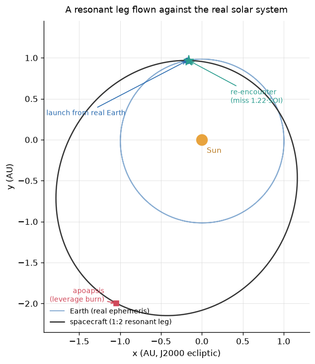
</p>

**Inclination is free up to a ceiling.** The reachable inclination from gravity
assists alone is `arcsin(v∞/v_P)` — set by the hyperbolic excess speed `v∞` and the
planet's orbital speed `v_P`, and independent of the planet's mass. A sequence of
same-body flybys (the crank) walks inclination up to that ceiling at fixed `v∞`; a
heavier or closer planet bends the velocity more per pass, so it needs fewer flybys
(Jupiter one, Venus about five — the diff-sim Venus tour reaches 32.8° against a 32.9°
ceiling, the same shape as Solar Orbiter's ~7–8 Venus assists to ~33°). The
mission-design reading is `v∞ ≥ v_P·sin(i)`: a polar orbit needs `v∞` at least the
planet's orbital speed. Given only a target inclination and a Δv-minimizing objective
— never told about leverage or cranking, seeded at zero leverage — the backprop
optimizer *discovers* the textbook plan: crank when the target sits under the ceiling,
and pump `v∞` first (V∞-leveraging) when it sits above, spending within 1% of the
analytic budget. Reaching the inclination that way costs 2–12× less Δv than a direct
plane change.

<p align="center">
  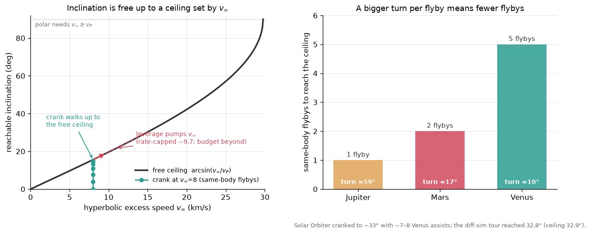
</p>

**The leverage is real, and the real Earth caps it.** A small burn at apoapsis changes
`v∞` at the next Earth encounter by far more than the burn itself — leverage L ≈ 15–37
measured against the real ephemeris. But the same leverage that turns a 5 m/s burn into
~75 m/s of `v∞` also throws the return off the real Earth, and holding the re-encounter
inside Earth's sphere of influence caps the pump near 0.085 km/s of `v∞` per leg. A
single-planet staircase creeps from `v∞` 8 to ~9.7 over ~18 legs and then stalls. Four
rounds pinned down why, each correcting the one before: the pump *does* survive real
ephemeris per leg (an earlier "it's dead" reading had used a burn ~20× too large); the
cap is not a quirk of one resonance (every resonance gives the same ~0.1 km/s/leg); it
is a one-control limit (a single apoapsis burn can't both pump `v∞` and re-aim the
encounter); and the obvious second control — bending the flyby — turns out to be
mis-timed, because it sets the outgoing orbit *before* the burn de-phases the return, so
it can't fix it. The correctly-timed correction (after the burn, or a second planet) is
the open thread.

<p align="center">
  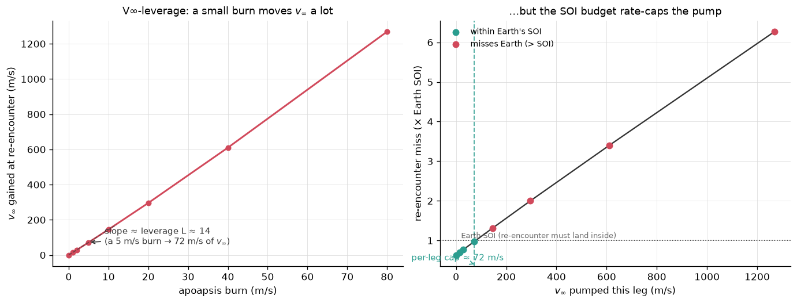
</p>

All of this is patched-conic, and it is a study of *mechanism*, not a Δv record: the
honest headline is that a gravity-assist plane change is cheaper across the board and
order-of-magnitude cheaper only at favorable leverage, and that an agent differentiating
through the physics finds the strategy on its own. The full pre-registered method and
verdicts — including the rounds that overturned earlier conclusions — are in
[`docs/ROADMAP.md`](docs/ROADMAP.md).

## Quickstart

```bash
uv sync --extra dev            # Python 3.12+, from pyproject/uv.lock
uv run pytest                  # physics, baselines, envs, solvability
uv run pyright                 # strict typing on the shipped library

# 2-D milestone (torch)
uv run python scripts/train_circularize2d.py

# 3-D JAX training run (GPU; CPU works, slower)
uv run --with "jax[cuda12]" python scripts/jaxsim.py \
  --init models/dagger_jax.npz --iters 3000 --chunk 60 --lr 1e-4 \
  --absorb --phi-dv --d-eps 1e-4 --trim-ep 16 --clip-ep 20000 --ema 0.995

# verify a fuel claim at high fidelity (float64, dt=1 s, both baselines)
uv run --with jax python scripts/verify_probe.py models/<ckpt>.npz

# regenerate the README figures
uv run --with jax --with matplotlib --with pillow python scripts/viz_readme.py models/<ckpt>.npz <logdir>
uv run --with jax --with matplotlib --with pillow python scripts/viz_readme_extra.py  # progression / weights / generalization / learning gif
uv run --with jax --with matplotlib --with pillow python scripts/viz_tier3.py          # CR3BP capture + J2-beat frontier (no checkpoint needed)
uv run --with jax --with matplotlib --with pillow python scripts/viz_lowthrust.py # low-thrust spiral (flies the E1 lt_2e-4 specialist)
uv run --with jax --with astroquery --with astropy --with matplotlib python scripts/viz_campaign.py  # N-body ephemeris tour + inclination ceiling + leverage cap (needs .ephem_cache)
```

Checkpoints and run logs are not committed (they regenerate by training); the
circularize-lineage checkpoints behind the figures are published as a
[GitHub release](../../releases/tag/readme-checkpoints). `docs/media/` holds the
small rendered figures only.

## Repository map

| Path | What it is |
|---|---|
| `tbot/` | The shipped library: quaternions, 2-D/3-D dynamics, orbital elements, attitude controller, Gymnasium envs. pyright-strict. |
| `scripts/jaxsim.py` | JAX/XLA 3-D diff-sim trainer (the research workhorse) with the full knob set. |
| `scripts/verify_probe.py` | float64/dt=1 s claim-verification harness (exact + tolerance-box baselines). |
| `scripts/eval_probe.py`, `norm_probe.py`, `step_probe.py`, … | The measurement toolkit the optimizer forensics ran on. |
| `ephemeris.py`, `scripts/nbody_sim.py`, `scripts/full_ephemeris_tour.py`, `leverage_anatomy.py`, `resonance_hopping.py`, `flyby_leverage.py` | The differentiable N-body / JPL-ephemeris engine and the gravity-assist study (inclination ceiling, v∞-leverage, the SOI rate cap). Each `--verify` runs offline against the cached ephemeris. |
| `docs/EXPERIMENTS_3D.md`, `docs/EXPERIMENTS.md` | The optimizer-forensics campaign (3-D) and the 2-D milestone methodology. |
| `docs/ROADMAP.md`, `docs/AUDIT.md` | Target maneuvers, the full gravity-assist campaign log, and the audit of the 2021 code. |
| `docs/GRAVITY_ASSIST.md` | Reader's digest of the differentiable N-body / gravity-assist arc (the inclination ceiling, leverage, and SOI rate cap). |
| `v2/`, `archive/` | The 2021 course project, kept as the "before" picture (excluded from CI/typing). |

## Roadmap

Circularize (3-D, done) → plane change (done) → low-thrust Edelbaum spiral
(done) → ballistic lunar capture in the CR3BP (done) → the differentiable
N-body engine on real JPL Horizons ephemerides, and the gravity-assist
inclination/leverage study on top of it (done, above) → the correctly-timed
leverage correction and a multi-planet tour (open) → benchmark against
historically flown trajectories. Any N-body fuel comparison is tested across
solar-system phases (syzygy effects are real physics but epoch-specific), and
gravity-assist missions are treated as a test of whether the agent can
*discover* an assist, not as a Δv target to beat.

## Provenance

Started in 2021 as a graduate astrodynamics course project that trained but
never converged — the original report and code are preserved in
[`docs/final-report.md`](docs/final-report.md), `v2/`, and `archive/`, and
the revival began by auditing why it failed
([`docs/AUDIT.md`](docs/AUDIT.md)). Everything physics is hand-rolled on
purpose: the point is to own the whole stack from the RK4 up.

MIT licensed. See [CONTRIBUTING.md](CONTRIBUTING.md) for how changes are
evaluated (pre-registered experiments, verification-fidelity claims).
