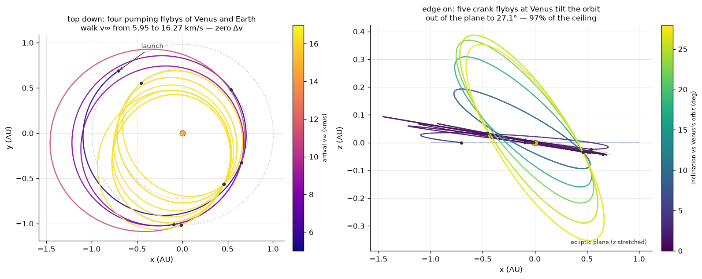
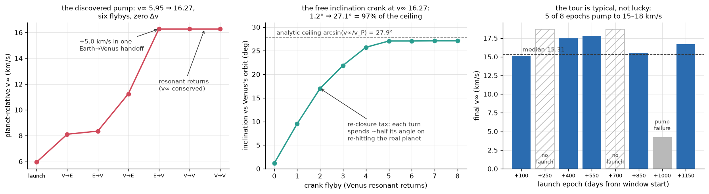

# Gravity assists in the real solar system

A reader's summary of the differentiable N-body / gravity-assist arc. The full
pre-registered log — every hypothesis, prediction, refute-by criterion, and the
rounds that overturned earlier conclusions — is in [`ROADMAP.md`](ROADMAP.md)
(rounds R-N1 through R-N27). This page is the digest.

## The engine

`scripts/nbody_sim.py` is a JAX rollout of a spacecraft under `K` point-mass
bodies. The body positions are pre-sampled from JPL Horizons (via `ephemeris.py`)
and held fixed within each RK4 step; the spacecraft state is integrated in physical
km/s units with IAU/DE440 gravitational parameters. The whole rollout is
differentiable, so `∂(miss distance)/∂(maneuver)` comes from the same backprop that
trains the circularize policy.

It is checked offline, with no network, before any result is quoted:

- two-body Kepler limit closes to `|Δr|/a = 9e-13`,
- energy is conserved to `7e-15`,
- from a cold `Δv = 0` start the optimizer recovers the analytic Lambert transfer to
  `1.24e-11` relative.

Holding bodies fixed within a step is accurate at heliocentric scale but breaks for
close geocentric orbits (Earth moves ~9000 km per step, larger than a LEO radius);
`rollout_interp` samples the bodies at the RK4 substages for those phases.

## Inclination has a ceiling, and it is free up to that ceiling

The reachable orbital inclination from gravity assists alone is

    i_max = arcsin(v∞ / v_P)

where `v∞` is the hyperbolic excess speed and `v_P` is the flyby planet's orbital
speed. The ceiling depends on `v∞` and the planet's speed, not on the planet's mass.
Read the other way, it is a mission-design law: the minimum `v∞` for a target
inclination `i` is `v_P·sin(i)`, so a polar orbit needs `v∞ ≥ v_P`.

A single flyby only turns the velocity by up to `δmax`. A *sequence* of same-body
flybys — the crank, the Cassini-at-Titan mechanism — walks the inclination up to the
ceiling at fixed `v∞`. A heavier or closer planet turns more per pass, so it needs
fewer flybys: Jupiter reaches the ceiling in one, Venus in about five. The diff-sim
Venus tour saturates at 32.8° against a 32.9° ceiling, the same shape as Solar
Orbiter's ~7–8 Venus assists to about 33°.

Given only a target inclination and an objective that minimizes Δv — never told about
leverage or cranking, and seeded at zero leverage — the backprop optimizer discovers
the textbook strategy on its own: pure crank when the target is under the ceiling
(Δv ≈ 7 m/s, essentially free), and pump `v∞` first when the target is above it,
spending 1.19 km/s where the analytic budget is 1.20. Reaching the inclination that
way costs 2–12× less Δv than a direct plane change — about 10× at favorable leverage
and low inclination, shrinking toward 2× near polar.

## The leverage is real, and the real Earth caps it

A small burn at apoapsis of a resonant orbit changes `v∞` at the next Earth encounter
by much more than the burn (V∞-leveraging). Against the real ephemeris the per-leg
leverage is L ≈ 15–37: a 5 m/s burn moves `v∞` by roughly 75 m/s.

But the same leverage that amplifies the burn into a `v∞` change also amplifies it into
a position shift at the return, `Δx ≈ Δv∞·t_enc`. Holding the re-encounter inside
Earth's sphere of influence therefore caps the pump near 0.085 km/s of `v∞` per leg. A
single-planet staircase creeps from `v∞ = 8` to ~9.7 over ~18 legs and then stalls.

Four rounds established why, each correcting the one before it:

| Round | Finding |
|---|---|
| R-N24 | A naive fixed-resonance staircase does not pump against the real Earth — the return drifts off Earth by several SOI and `v∞` falls. |
| R-N25 | The leverage is not dead. R-N24 had used a burn ~20× too large; at the right few-m/s scale the pump survives per leg (L ≈ 15–37) but is rate-capped by the SOI budget (~0.085 km/s/leg), so it stalls near 9.7. |
| R-N26 | The cap is not a quirk of one resonance. Every feasible resonance gives the same ~0.1 km/s/leg. It is a one-control limit: a single apoapsis burn cannot both pump `v∞` and re-aim the encounter. |
| R-N27 | The obvious second control — bending the flyby — is mis-timed. It sets the outgoing orbit *before* the burn de-phases the return, so it cannot correct that de-phasing. It spans ~7 resonances (it is a strong control) but leaves the per-leg cap unchanged. |
| R-N28 | The correctly-timed correction — a cleanup maneuver *after* the burn — does break the cap (pump ~10× the per-leg limit), but only at effective leverage ≈ 1: a Δv-for-time trade, no longer amplified. The free pump stays SOI-bounded. |
| R-N29–R-N31 | The cheap escape is multi-planet. Inner planets pump faster (shorter years, more encounters); the handoff between planets rides the conserved Tisserand parameter, so it costs nothing, and it survives real phasing at 40–53% of epochs. There is no hard `v∞` ceiling — only a soft one from the flyby turn `δmax` collapsing, which bites lightest planets first. |
| R-N32–R-N33 | Chained against the real ephemeris, the pump composes — but a greedy chain stalls at 1–2 flybys. A beam search breaks the wall (6 flybys) by taking legs that *lose* `v∞` locally to unlock a larger pump later. |

## Making discovery differentiable took a reformulation

The obvious differentiable setup — solve each leg as a boundary-value problem (Lambert)
and penalize any flyby mismatch — fails in an instructive way. The resonant-return legs
a deep tour needs sit at near-singularities of the boundary-value problem: `v∞` there
blows up to 50–60 km/s and its gradient spikes past `1e18`. An optimizer chasing `v∞`
climbs straight into those singularities and reports huge speeds while quietly violating
the flyby-matching constraint. Clipping, penalty schedules, and reward caps do not save
it — the failure is in the formulation.

The fix is structural. Propagate each leg *forward* with a differentiable Kepler
propagator, so there is no boundary-value solve anywhere. Make the flyby a bounded
rotation of `v∞`, so `|v∞|` is conserved exactly by construction — the constraint the
optimizer used to cheat no longer exists as a constraint. And close each encounter with
the real moving planet by damped Gauss-Newton *inside* the differentiable loop.
Encounters then close to meters against the real ephemeris and gradients flow end to
end through the closed solutions.

## The tour that architecture finds

From a 5.95 km/s launch, tree search over the ballistically-closed continuations reaches
`v∞ = 16.3 km/s` in four pumping flybys of Venus and Earth (one Earth→Venus handoff is
worth +5.0 km/s by itself), with every encounter hit to sub-kilometer miss and zero
deterministic maneuvers. Once the pump saturates — the flyby turn `δmax` has shrunk to
19° at that speed — five more Venus flybys crank the inclination from 1° to 27.1°,
97% of the `arcsin(v∞/v_P)` ceiling.

The crank pays a tax the idealized theory misses. In the clean model, every degree of
flyby turn is available for the plane change. Against the real ephemeris each flyby
must *also* re-hit the moving planet, and that re-targeting pins about half of every
turn — so the walk to the ceiling takes ~5 encounters instead of the ideal ~2. Slower,
but the ceiling is still reached, exactly ballistically.

And it is not a lucky date. Across eight launch epochs spanning two synodic cycles,
five pump to 15–18 km/s (median 15.3), two have no viable cheap launch at all (the
phasing scarcity measured earlier: only ~half of epochs offer a usable handoff), and
one launches fine but never climbs. The failure modes are part of the result.

## Honest scope

This is patched-conic throughout, and it is a study of mechanism, not a Δv record.
The reachable-inclination ceiling `arcsin(v∞/v_P)` is a kinematic identity; the
leverage and its rate cap are measured against the real time-tagged ephemeris; and the
strategy is *discovered* by an agent differentiating through the physics, not hand-coded.
Gravity-assist missions are treated as a test of whether the agent can find an assist,
never as a Δv target to beat (real assist tours are near-impossible to beat on Δv, and
beating one would not mean the flown trajectory was suboptimal — it optimized a
different objective). See [`BENCHMARKS.md`](BENCHMARKS.md) for the flown-mission
comparison methodology and [`ROADMAP.md`](ROADMAP.md) for the full round-by-round log.
